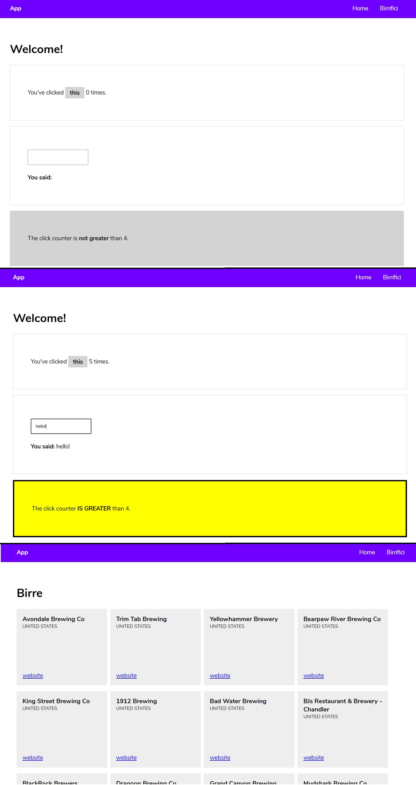

# Angular-first-project
Simple app to learn the core concepts of Angular like basic templating, components, data binding, style & class binding, routing and fetching data from an API with HTTP client.

HTML, CSS, Angular.

### Preview:
